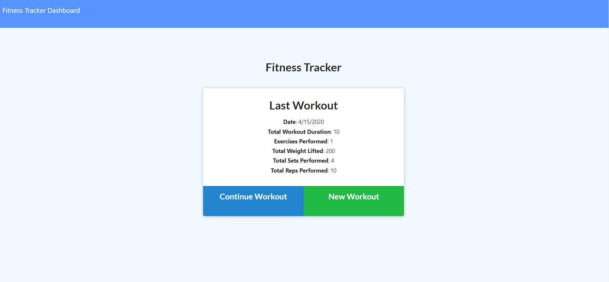
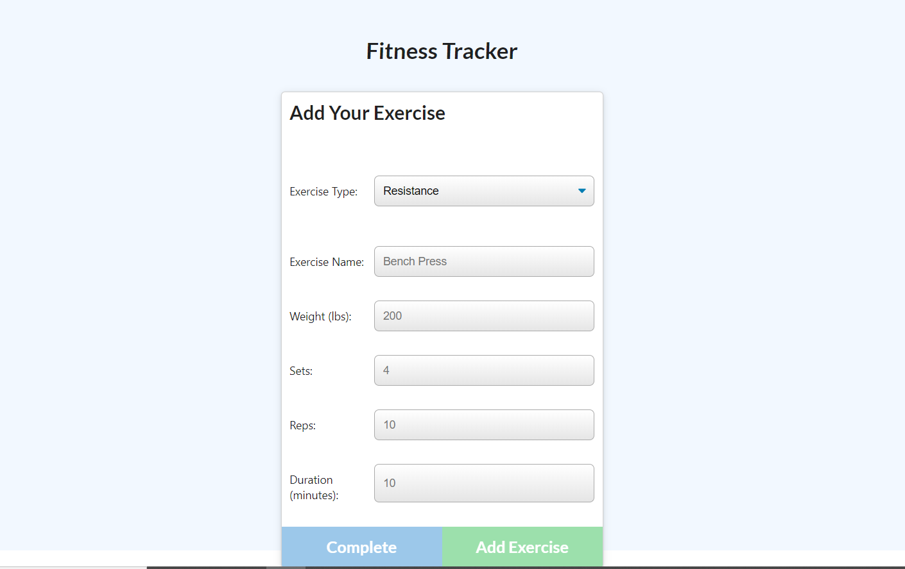
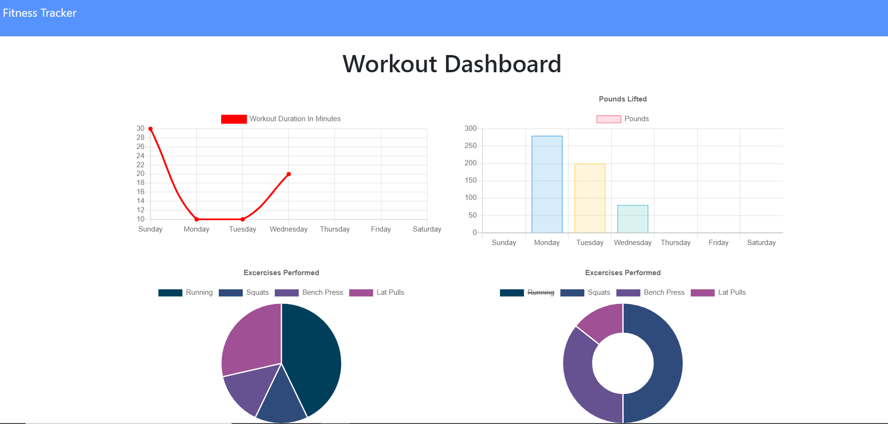

## User Story

* As a user, I want to be able to view create and track daily workouts.

## Business Context

A consumer will reach their fitness goals quicker when they track their workout progress.

## Description

A workout tracker using a Mongo database with a Mongoose schema that handles routes with Express.

## Deployment 


## Running locally

1. Install the dependencies: ```npm install```;
2. In a separated terminal run ```mongod``` /
3. Add the seeds: ```npm run seed```;
4. Run: ```npm start```;
5. The default  port is *3000*, so to access you must go to **http://localhost:3000**

## Dependencies

* [MongoDB](https://www.mongodb.com/)
* [Express](https://expressjs.com/)

## Screenshots



